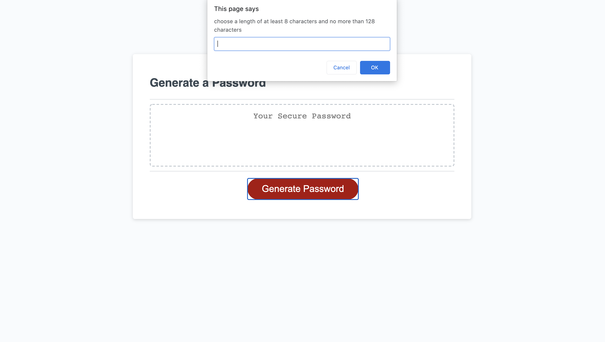
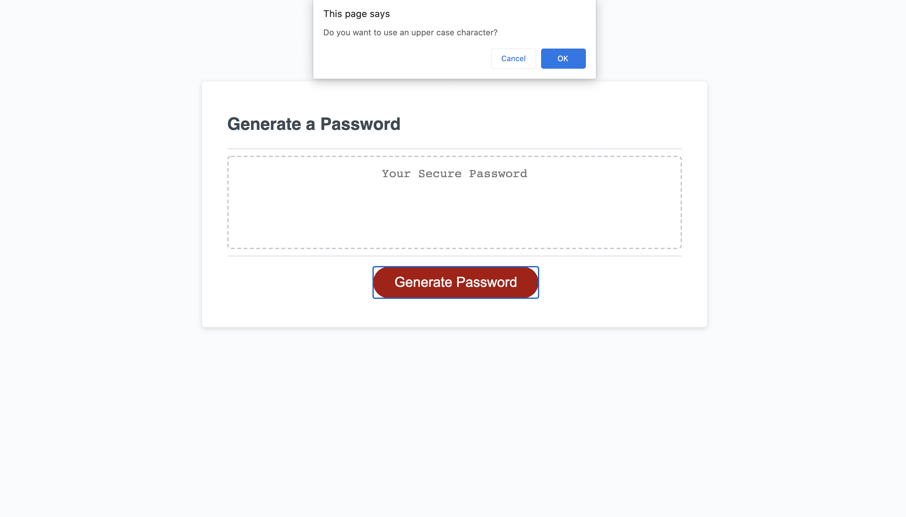
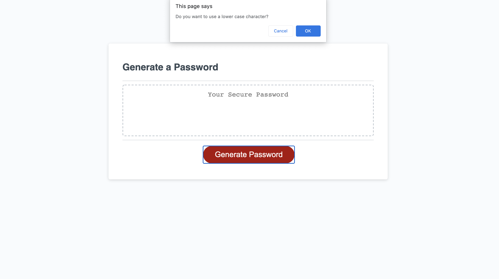
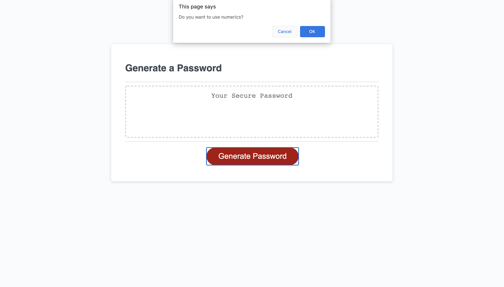
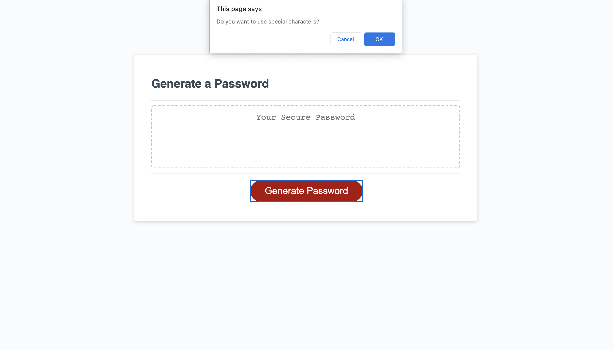
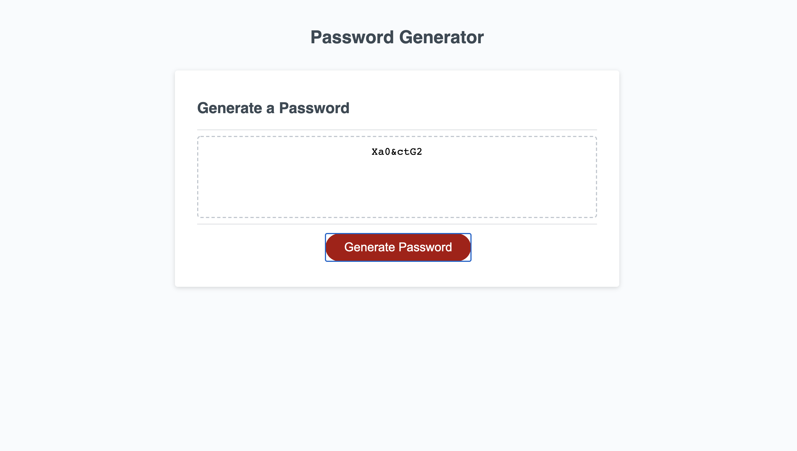

# PasswordGenerator

The main goal of this project is to create a random password generator using different methods and properties available in JavaScript. 

## Acceptance Criteria

* When the user clicks on the Generate Password button, It has to create a random password based on the user selected Criteria.
* The user will be prompted to enter the length of the password.
* The password has to be more than 8 characters and less than 128 characters in length.
* Then the user will have the ability to choose which type of characters to be used in the password generated.
* We can choose to have or not have lower case, upper case, numeric and/or special characters.
* Each of the selection has to be registered and then the password should be generated.
* The generated password should have atleast one letter which is in the selected character type criteria.

## Logic Involved

The critical part of the program is to have atleast one letter from the selected types of characters. In order to achieve this , there are two strings declared with names str1 , str 2. str1 has each word selected from each type of character selected, str2 has the random string with all the types of characters included in it. If the entered password string is less than 8 or greater than 128 characters, the page would alert to enter the length of password string again.

The generated password will be displayed in the textbox

## Password Generation

## Overview
The code developed uses HTML and CSS to customize the UI and JavaScript is used for handling different events involved in the password generation. The password is created randomly based on the different user criteria entered by answering the prompts 

## Series of Events while generating a passowrd

* Enter the length of the password

* Enter if you want Upper Case letters in your password string

* Enter if you want Lower Case Letters in your password string

* Enter if you want numerics in your password string

* Enter if you want special characters in your password string.

* Password string is generated based on the selected criteria including atleast one letter for the each type of character selected

## Installation

You can install this project on your local machine by cloning the project using SSH Key by clicking [Here!](git@github.com:anurav18/PasswordGenerator.git)
You can Generate a random password by Clicking [Here!](https://anurav18.github.io/PasswordGenerator/)

## License

Unknown

* This project is created as a part of the BootCamp program organized by University of Washington.

